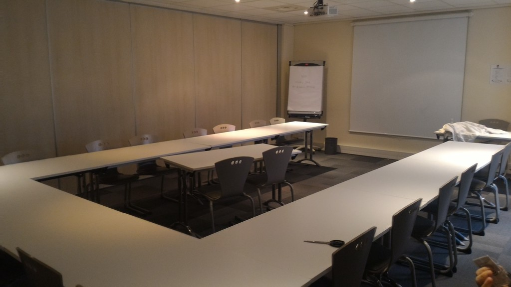

# 2016-12-20 Weekly Online Meeting Minutes

## Attendees

* Neil Bowers
* Philippe Bruhat

## Agenda and Planned Tasks

* Neil
  1. contact initial tier 1 to confirm who is in tier 1,
     and check the proposed date with them [DONE]
  2. create first draft of sponsorship prospectus [IN PROGRESS]
  3. create trello board for tracking sponsor prospects,
     and add all the good prospects [DONE]
* Philippe
  1. work towards resolving date, costs and facilities with hotel [DONE]
  2. meeting minutes (for the organisers, but written with the assumption
     of a potentially larger audience) [DONE]
  3. get in touch with Booking.com internally to talk about sponsorship [DONE]

## Minutes

### Date selection

To simplify the date selection, as Google Sheet has been set up, asking
the 11 core people (and Philippe, the local organiser) which of the
extended Thursday-Sunday week-ends between March 23 and May 28 2017
they were available or not. With a scoring of 1 per OK, 0 per NOT OK,
and 0.5 per "possible but rather not", the best two week-ends were May
18-21 (10.5) and May 11-14 (9.5) points. In both cases only David Golden
was not available (Tatsuhiko Miyagawa did not answer the poll).

When contacting the hotel to book the meeting rooms, Philippe was told that
our preferred date (May 18-21) was already booked, so we had to settle for
May 11-14.

### Meeting with the hotel

On December 20, Philippe had a meeting with Géraldine Giraud, who is
managing the meeting spaces in the [Campanile Lyon Part-Dieu][1] hotel.

[1]: https://www.booking.com/hotel/fr/campanile-lyon-centre-forum-part-dieu.en.html

Two adjacent meeting rooms were booked for May 11-14. The rooms have
a mobile wall between them (enabling us to split the space in two for
meetings), with a total area a little above 100 square meters. The room
layouts can be arranged in advance (U-shape, boardroom, classroom, etc.).

The rooms are very close to the bar/lobby area (which now includes a
Bonzini style [table football][2] game) and the restaurant. There are
also snack available form the reception 24/7. Ms. Giraud told Philippe
she could preorder extra snacks for the event if needed.

[2]: https://en.wikipedia.org/wiki/Table_football

We got written (by email) and oral confirmation that organising our own
lunches in the meeting space was possible. They were informed we would
probably have our own coffee machines.

Parking space is available if needed (there is a code for opening the
doors when going in and out, which is changed weekly).

The room rate has been confirmed to be 70 EUR/night (59 EUR/night + 9.90
EUR breakfast + 1.10 EUR city tax). We will book 40 rooms in advance
from Wednesday May 10 till Monday May 15 (5 nights), and the hotel will
give us a deadline for cancelling the unneeded rooms. (It should also be
possible to arrange longer or shorter stays with enough advance notice.)
The rooms will be double rooms, unless twins are required.

Advance payment of one third of the total is expected. We will get separate
quotes for the meeting space and the hotel rooms, so that we can quickly
(before securing all the sponsorship money) pay the first installment for
the meeting rooms.

Géraldine Giraud was given the names, roles and emails of all three
organisers. She now knows that Laurent Boivin will be handling the
payments.

### Sponsors

Philippe was in Amsterdam on December 13-14, quickly met with Stevan
Little, and confirmed that we should send him the prospectus with
the various sponsorship levels, and that he would follow up with the
purchase order internally. He expects Booking.com to pick up the highest
sponsorship level.

Now that the date is set, Neil will prepare a first draft of
the prospectus, and Philippe will work on a blog entry for
[blogs.perl.org](http://blogs.perl.rog/).

### Second tier of attendees

Neil put up a second Google Sheet document, with a preselection of names
for the second tier. The first tier will be invited to vote on the names
(and add new ones). Once this step is completed, Neil will produce the
list for the second tier.

They will then be emailed ASAP, to increase their likelihood of attending.

### Schedule of online meetings

Since Philippe is in Amsterdam almost every other Tuesday, it turns out it's
not a convenient day for online meeting. We agreed to move them to Thursdays.

## Next Meeting

irc.perl.org, #qah2017, 2016-12-29 12:00 UTC

Tasks:

* Neil
  1. write the sponsorship prospectus
  2. collect the names of the second wave of attendees
* Philippe
  1. announce the official dates to the core group
  2. write (and publish) the initial announcement blog post
